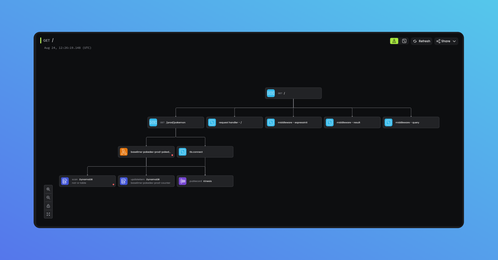

# Node.js Baselime OpenTelemetry SDK
[![Documentation][docs_badge]][docs]
[![Latest Release][release_badge]][release]
[![License][license_badge]][license]

Instrument your Node.js applications with OpenTelemetry and send the traces to [Baselime](https://baselime.io).



  
## Getting Started 

Check out the [documentation](https://baselime.io/docs/sending-data/opentelemetry/).

## Example

```javascript
import { BaselimeSDK } from '@baselime/node-opentelemetry';
import { getNodeAutoInstrumentations } from '@opentelemetry/auto-instrumentations-node';


const sdk = new BaselimeSDK({
  instrumentations: [    
    getNodeAutoInstrumentations(),
  ],
});

sdk.start();
```

## Configuration

The BaselimeSDK class takes the following configuration options

| Field            | Type                    | Description                          |
| ---------------- | ----------------------- | ------------------------------------ |
| instrumentations | InstrumentationOption[] | An array of instrumentation options. |
| baselimeKey      | string (optional)       | The Baselime key.                    |
| collectorUrl     | string (optional)       | The URL of the collector.            |
| service          | string (optional)       | The service name.                    |
| namespace        | string (optional)       | The namespace.                       |

## License

&copy; Baselime Limited, 2023

Distributed under Apache 2 License (`Apache-2.0`).

See [LICENSE](LICENSE) for more information.

<!-- Badges -->

[docs]: https://baselime.io/docs/
[docs_badge]: https://img.shields.io/badge/docs-reference-blue.svg?style=flat-square
[release]: https://github.com/baselime/node-opentelemetry/releases/latest
[release_badge]: https://img.shields.io/github/release/baselime/node-opentelemetry.svg?style=flat-square&ghcache=unused
[license]: https://opensource.org/licenses/MIT
[license_badge]: https://img.shields.io/github/license/baselime/node-opentelemetry.svg?color=blue&style=flat-square&ghcache=unused
