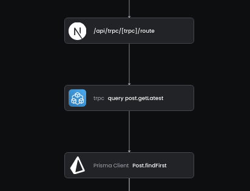

# TRPC OpenTelemetry Middleware

Trace your TRPC Applications. If you don't use OpenTelemetry yet please see https://baselime.io/docs/sending-data/opentelemetry



## Installation

```bash
npm i @baselime/node-opentelemetry
```

## Setup

Add the Middleware to the procedures you want to trace

```typescript
// trpc.ts
import { trpcTracingMiddleware } from "@baselime/node-opentelemetry";

const t = initTRPC.context<typeof createTRPCContext>().create({
  ...
});

// add the middleware to all the procedures you want to trace
export const publicProcedure = t.procedure.use(trpcTracingMiddleware({ collectInput: true }))
```